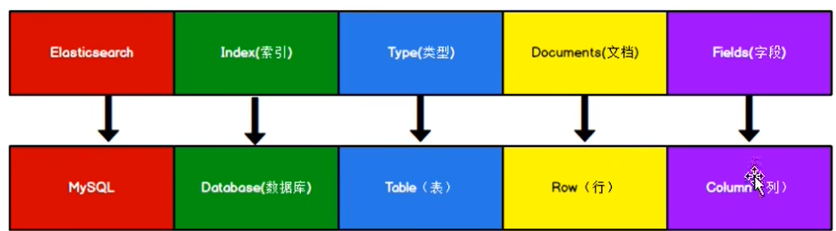

# ElasticSearch

## 1.介绍

ES是面向文档型数据库，一条数据及一个文档。



关键概念：es中的index可以看作一个库，type看作一个表，documents看作一行

但在6.x中type概念已经弱化。

正排索引


倒排索引：

keyword     id

name          1001,1002

zhang          1001

这里看出，表的概念已经弱化。


## 2.操作尝试

### 2.1索引操作

POST http://localhost:9200/worldflipper/_update/1001

坑：只接收主体doc

```
{
   "doc":{
        "details":"update只接受主体doc",
        "rw":"任炜111",
        "idd":"你给多少id就是多少-完全覆盖性"
   }
}
```

GET http://localhost:9200/worldflipper/_doc/1001 查询1001数据

```
{
    "_index": "worldflipper",
    "_id": "1001",
    "_version": 8,
    "_seq_no": 8,
    "_primary_term": 1,
    "found": true,
    "_source": {
        "rw": "任炜111",
        "idd": "你给多少id就是多少-完全覆盖性",
        "details": "update只接受主体doc"
    }
}
```

GET http://localhost:9200/worldflipper/_search 全数据查询

GET http://localhost:9200/worldflipper/_search?q=rw:"任炜111"   路径参数方式查询

GET http://localhost:9200/worldflipper/_search 请求体方式查询，且查询内容类似模糊查询

```json
{
    "query":{
        "match":{
            "rw":"炜"
        }
    }
}

// 一下是请求体的全部查询 并且 设置分页显示，以及制定显示和排序，下面例子中是对文本的排序
{
    "query":{
        "match_all":{
        }
    },
    "from":0,
    "size":2,
    //指定显示
    "_source":["rw"],
    //排序
    "sort":{
        "rw.keyword":{"order":"desc"}
    }
}

{
    "query":{
        "bool":{
            //多个条件同时成立 类似and逻辑
            // "must": [
            // 类似OR逻辑
            "should":[
                {
                    "match":{
                        "rw":"炜"
                    }
                },
                // //再加一个条件
                {
                    "match":{
                        "details":"doc"
                    }
                }
            ],
            "filter":{
                "range":{
                    // price大于5000的的数据
                    // "price":{"gt":5000}
                }
            }
        }
    }
}


```

