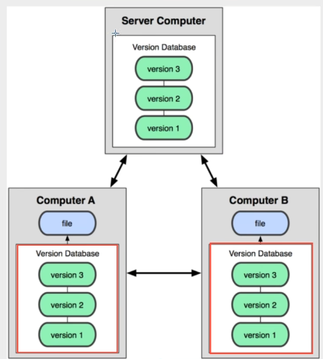
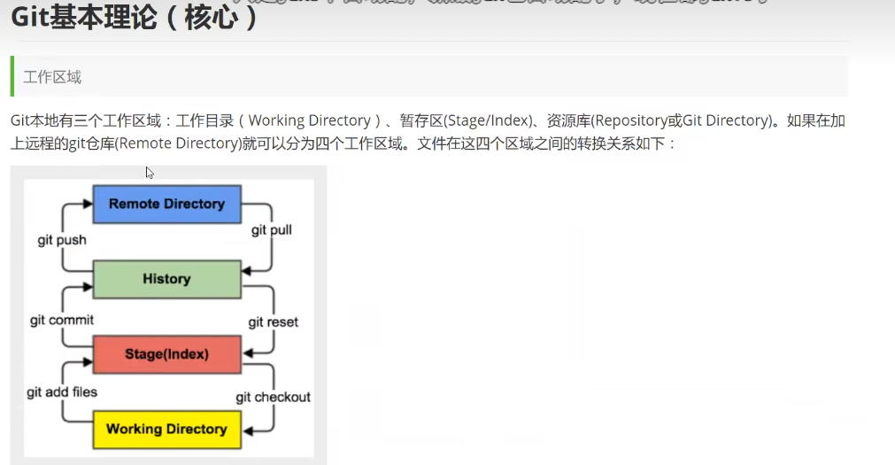
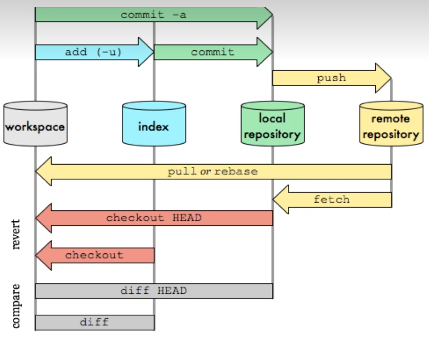
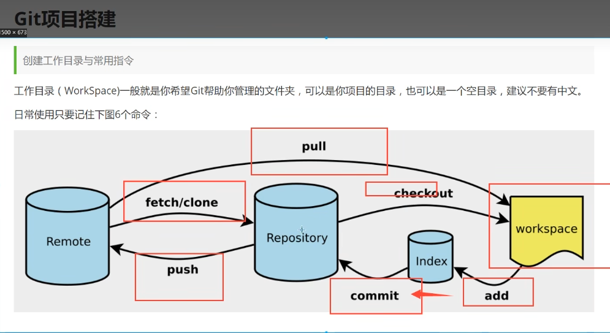
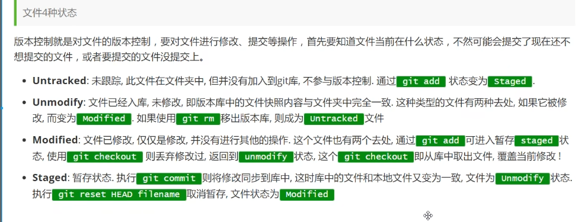
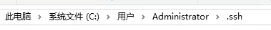
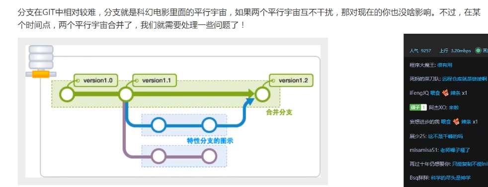
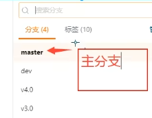

# 版本控制

本地版本控制

集中版本控制 SVN

历史版本都在服务器上，所以得定期保存

分布式版本管理系统



每个人都有全部的代码

离线本地提交，联网时push。

# Git配置

```
git config --global user.name  "任炜"
git config --global user.email "2783800599@qq.com"
```

# Git基本理论










```
# 初始化项目
git init
# 下载项目
git clone url 
```


# Git文件操作




``` 
# 添加文件到暂存区
git add . 
# 提交暂存区内容到本地仓库 -m 提交信息
git commit -m "new file hello.txt"


# 忽略文件 idea中有.gitignore 规则如下
*.txt # 忽略所有.txt结尾的文件。
!lib.txt # 但lib.txt除外
/temp # 仅忽略根目录下的temp文件，子目录的TODO不会被忽略
build/ # 忽略build/目录下的所有文件
doc/*.txt # l


# 本机免密码登录 gitee
SSH 公钥 : xxxxxxxxxxxxxxxxx
# gitbash 生成公钥
ssh-keygen -t rsa
# 将公钥注册到码云中(本地的C .ssh/id_rsa.pub) 得到密钥


```



# Git分支






```
# git 常用分支命令
git branch # 查看本地分支
git branch -r # 列出所有远程分支 -remote
git branch dev # 新建了分支
git checkout -b [branch] # 切换到某个分支
不要直接push，push前先 fetch下远程代码，如果有冲突，先fetch本地 到本地，看了哪里不一样，然后再push

在dev上操作，然后搞好后merge到主分支上
```


```
主干与分支之间的操作
主干：main
分支：master

git config --global user.name 'songdanming'
git config --global user.email '1643137133@qq.com'

git remote add origin https://github.com/doudou5628891/项目.git
git remote set-url  origin https://[token密码]@github.com/doudou5628891/项目.git


git status //查看文件状态
git 
git branch -a 查看所有分支 


git push test --delete [branchname]删除远程分支
git rm -f 文件名   //删除工作区和暂存区文件，并且将这次删除放入暂存区


git checkout master // 切换到分支
git pull test master // 更新本地分支
//一顿文件操作
git add .           // 添加操作的所有东西
git commit -m "description" // 提交
git push test master // 上传

git checkout main  // 切换主干
git pull test main // 远程拉主干
git merge master   // 合并本地的master到本地主干中
git push test main // push到远程主干


```

