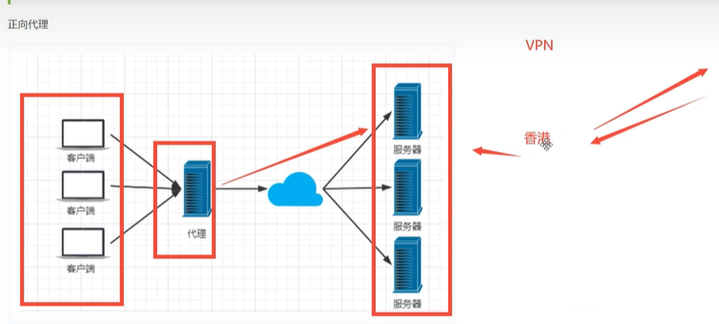
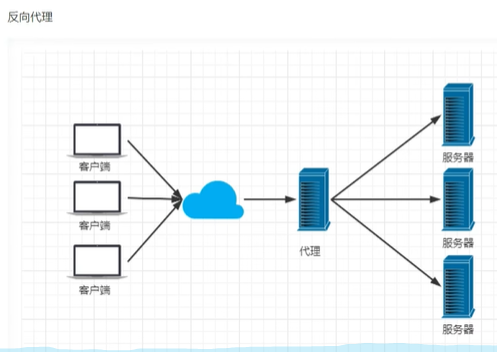
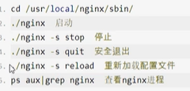
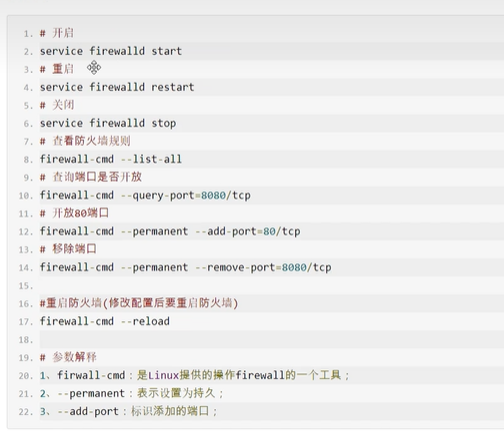
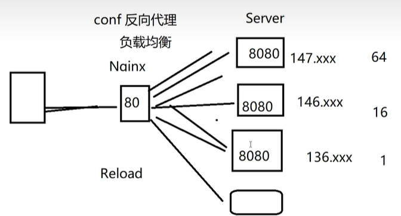

# Nginx

## Nginx作用

Http代理，反向代理，作为web服务器常用的功能之一


正向代理，也就是代理客户端的服务器，同时也有代理服务器的服务器。





Nginx 提供负载均衡策略有2种：**内置策略和扩展策略**


内置策略：轮询，加权轮询，lp hash。扩展策略，自定义。


动静分离，在软件开发中，有些请求需后台处理，有些请求是不需要的（如css、html、jpg、js等文件，即静态文件）。  静态资源可以从nginx直接返回。


ubuntu安装方法

https://www.jianshu.com/p/830eaceee167


## Nginx常用指令






## Nginx 配置

```c
//全局配置
#user  nobody;
worker_processes  1;

#error_log  logs/error.log;
#error_log  logs/error.log  notice;
#error_log  logs/error.log  info;

#pid        logs/nginx.pid;

//监听线程
events {
    worker_connections  1024;
}


// http相关配置
http {
    // 静态资源相关配置
    include       mime.types;
    default_type  application/octet-stream;

    #log_format  main  '$remote_addr - $remote_user [$time_local] "$request" '
    #                  '$status $body_bytes_sent "$http_referer" '
    #                  '"$http_user_agent" "$http_x_forwarded_for"';

    #access_log  logs/access.log  main; 

    sendfile        on;
    #tcp_nopush     on;

    #keepalive_timeout  0;
    keepalive_timeout  65;
	
    #gzip  on;
    
    //负载均衡配置
	upstream kuangstudy(任意即可){
     	#服务器资源 两个服务器 weightq   
        server 127.0.0.1:8080	weight=1;
        server 127.0.0.1:8081	weight=1;   
        //当然地址不一样端口号一致也是可以的
    }
    
    //进行server配置
    server {
        listen	80;
        server_name	localhost;
        //根目录
        location / {
            // xx 服务器A
            
            root	html;
            index	index.html index.htm;
           	//反向代理
            proxy_pass	http://kuangstudy;
        }
        
        location /admin{
            // xx 服务器B
        }
        
    }

    
    # HTTPS server 相关配置
    #
    #server {
    #    listen       443 ssl;
    #    server_name  localhost;

    #    ssl_certificate      cert.pem;
    #    ssl_certificate_key  cert.key;

    #    ssl_session_cache    shared:SSL:1m;
    #    ssl_session_timeout  5m;

    #    ssl_ciphers  HIGH:!aNULL:!MD5;
    #    ssl_prefer_server_ciphers  on;

    #    location / {
    #        root   html;
    #        index  index.html index.htm;
    #    }
    #}
```



## Nginx 服务器安装及配置文件详解

https://www.runoob.com/w3cnote/nginx-install-and-config.html

