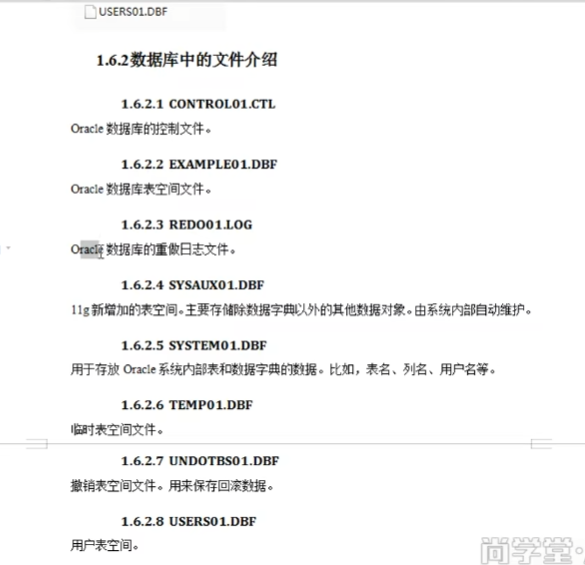
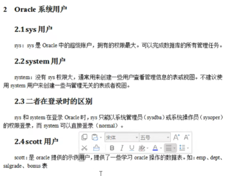
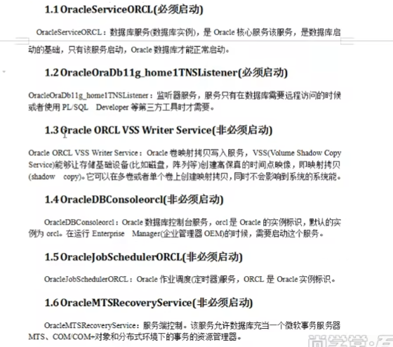

# Oracle

## 1.1 常用数据类型

 CHAR CHAR数据类型存储固定长度的子符值。一个CHAR数据类型可以包括1到2000个字符。如果对CHAR没有明确地说明长度，它的默认长度则设置为1.如果对某个CHAR类型变量赋值，其长度小于规定的长度，那么Oracle自动用空格填充。

Varchar，Varchar2 :表示一个字符串

 Oracle推荐使用VARCHAR2  VARCHAR2存储可变长度的字符串。虽然也必须指定一个VARCHAR2数据变量的长度，但是这个长度是指对该变量赋值的的最大长度而非实际赋值长度。不需要用空格填充。最多可设置为4000个字符。

NUMBER :NUMBER(A,B):表示一个小数，总长度是A，小数是B，整数是A-B；

NUMBER(A)表示一个整数，长度为A

DATA表示日期类型

CLOB：大对象，表示大文本数据类型，可存4G

BLOB：大对象，表示二进制数据，可存4G

BFILE数据类型用做指向存储在Oracle数据库以外的文件的指针


    类型转换
    Oracle会自动将某些数据类型转换成其他的数据类型，转换取决于包括该值的SQL语句。
    数据转换还可以通过Oracle的类型转换函数显示地进行。
    
    连接与比较
    在大多数平台上Oracle SQL中的连接操作符用两条竖线（||）表示。连接是将两个字符值连接。Oracle的自动类型转换功能使得两个数字值也可以进行连接。
    
    
    admin目录
    记录Oracle实例的配置，运行日志文件。








window10安装oracle：https://www.modb.pro/db/38320


```
sqlplus "/ as sysdba" 连接到Oracle
select instance_name from v$instance; // 列出所有数据库

create user 用户名 identified by 密码
grant connect,resource,create any view,create any synonym,create session,create database link to 用户名;

```


## 1.2创建表空间

```oracle
create table waterboss
datafile 'c:\waterboss.dbf'
size 100m // 设置100m
autoextend on //100m满了 自动扩充10m
net 10m //
```

