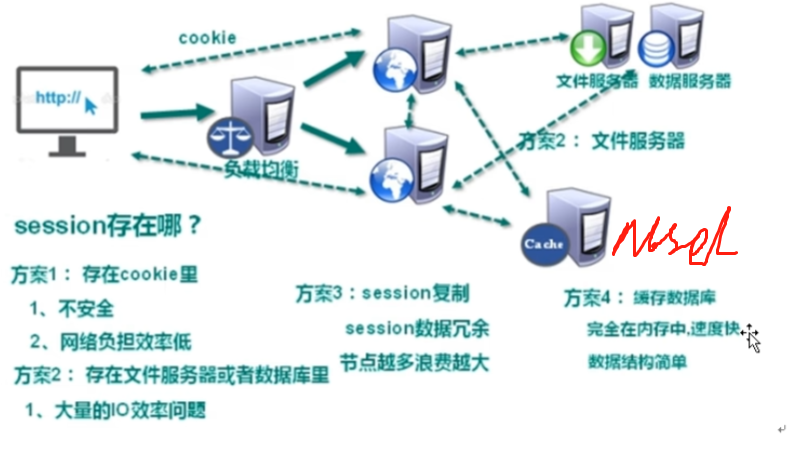
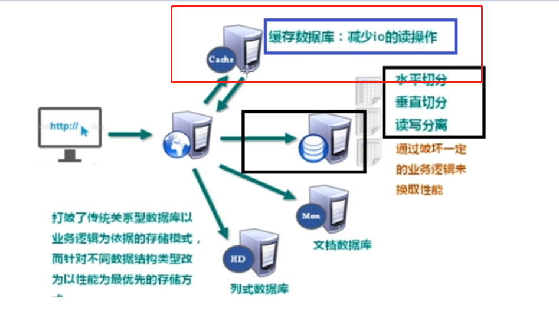
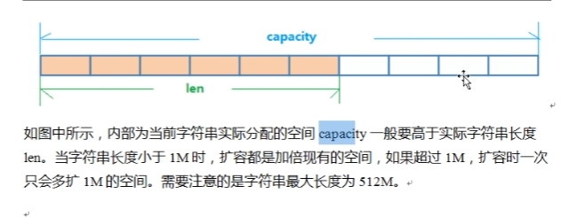
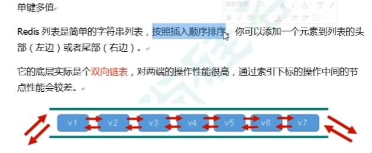

# 1.Redis





not only sql 指非关系型数据库

不遵循SQL标准

不支持ACID

远超于SQL的性能

## 1.2适用此场景

对数据高并发读写

海量数据的读写

对数据高扩展性


redis 数据都在内存中，支持持久化，主要用作备份恢复

除了支持简单的key-value模式还支持多种数据结构

一般作为缓存数据库辅助持久化的数据库

mongodb 文档型数据库 数据都在内存中，内存不足则把不常用的数据保存在硬盘中

虽然是key-value模式，但对value尤其是json提供了丰富的查询功能

支持二进制数据及大型对象

可以根据数据特点代替RDBMS，成为独立的数据库，或者配合RDBMS，存储特定的数据。

## 1.3Redis特点

开源的Key-value存储系统

它支持存储的value类型相对更多，包括String 、list、set、zset（有序集合）、hash（哈希类型）

上述数据类型都支持push/pop、add/remove 及取**交集并集** 和**差集**，这些操作都是原子性的


单线程+多路IO复用

## 1.4常用指令


```
Redis key

expire key 10 //10s 为给定的key设置过期时间
ttl key // 查看还有多少秒过期，-1表示永不过期，-2表示已过期
select 切换数据库
dbsize查看当前数据库的key的数量
flushdb 清空当前库
flushall 通杀全部库


keys * 输出所有数据
exists key //判断某个key是否存在
type key //查看你的key是什么类型
del key // 删除指定的key数据
unlink key //根据value选择非阻塞删除，仅将keys从keyspace元数据中删除，真正的删除会在后续异步操作


set k1 v100
set k2 v200
get k1 //输出 "v100"
set k1 v1100 //k1发生覆盖
append k1 abc // k1值为 v1100abc
strlen k1d // 8
setnx 也能设置值，不过是在键 不存在时
incr // 将key 中存储的数字值增1，只能操作数字或空值（新增值为1）
decr // 
incrby/decrby <key><步长> 将key中存储的数字值增减。自定义步长，而且属于原子操作

zadd <key><score1><value1><score2><value>

mset <key1><value1><key2><value2> // 设置多个
mget <key1><key2>
msetnx // 同时设置一个或多个键值对，当且仅当所有给定key都不存在
getrange <key><起始位置><结束位置> 类似输出某段字符串函数
setrange <key><起始位置><value> //在起始位置覆盖值
setex key 过期时间 value setex name 20 rw
getset name jack  以新值换旧值
```

**redis是单线程插件，所以操作都 属于原子操作**，操作中间不会有任何context switch（切换到另一个线程）

（1）单线程，能够在单条指令中完成的操作都可以认为是**原子操作**，因为，**中断只能发生在指令之间**。

（2）多线程，不能被其他进程（线程）打断的操作就是原子操作。


String是Redis最基本的类型，可以理解成与Memcached一模一样的类型，一个key对应一个value

String是二进制安全的，Redis的String可以包含热河数据，比如jpg图片，或者序列化对象

```
二进制安全是一种主要用于字符串操作函数相关的计算机编程术语。一个二进制安全功能（函数），其本质上将操作输入作为原始的、无任何特殊格式意义的数据流。对于每个字符都公平对待，不特殊处理某一个字符。
C语言中的字符串是根据特殊字符“\0”来判断该字符串是否结束，对于字符串str="0123456789\0123456789”来说，在C语言里面str的长度就是10（strlen(str)=10），所以strlen()函数不是二进制安全的。而在Redis中，strlen str的结果是21，是二进制安全的（Redis底层所使用的字符串表示是Sds），它只关心二进制化的字符串，不关心字符串的具体格式，里面有啥字符，只会严格的按照二进制的数据存取，不会以某种特殊格式解析字符串。
redis的String更加原始
```


# 2数据结构

 Simple Dynamic String SDS。是可以修改的字符串，内部结构类似ArrayList，采用预分配冗余空间的方式来减少内存的频繁分配。



## 2.1 List

单键多值



```
常用指令
lpush/rpush <key><value1><value2>   从左边/右边插入一个或多个值
lpop/rpop <key>， 值在键在，值亡键亡

rpop lpush
lrange key 0 -1
lpop key
rpop key

lindex key 0 //根据索引获取值
llen key // 获取列表长度
linsert key before <value><new value>在value之前插入new value
lrem key num value 从左边啥

```

