# Spring Security

## 1. In Spring Boot


## 2. In Spring cloud

### 2.1 Spring Security简介

........

最主要的两个功能：认证和授权

认证：登录的一个过程

授权：系统判断是否有权限进行操作


### 2.2 OAUTH

任何第三方都能使用OAUTH认证服务

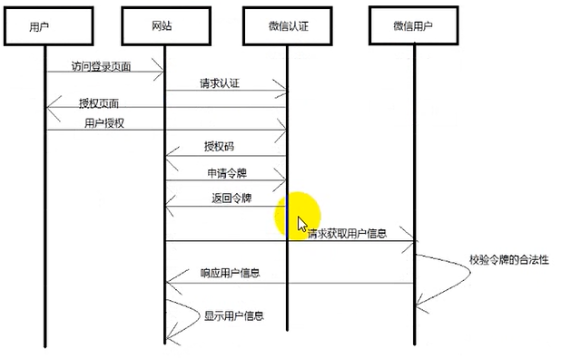

1. 用户访问登录页面，选择微信登录。
2. 弹出微信二维码框
3. 


#### 2.2.1 角色

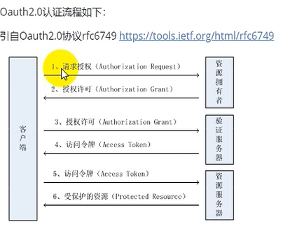

客户端

资源拥有者

授权服务器（认证服务器）

资源服务器

#### 2.2.2 常用术语

客户凭证： client credentials 客户端的clientId和密码用于认证客户

令牌（tokens）：

作用域（scopes）：

#### 2.2.3 令牌类型

授权买

访问令牌

刷新令牌

bearerToken ：不管谁拿到Token都可以访问资源

PoP token：可以校验Client是否对Token有明确的拥有权

#### 2.2.4 特点

优点：


缺点：


#### 2.2.5 授权模式

。。。。。。


### 2.3 JWT 

https://blog.csdn.net/manong20210713/article/details/119810494

分为

Header（头部）

payload（负载）

signature（签名）

```java

Auth0 实现的 com.auth0 / java-jwt / 3.3.0
Brian Campbell 实现的 org.bitbucket.b_c / jose4j / 0.6.3
connect2id 实现的 com.nimbusds / nimbus-jose-jwt / 5.7
Les Hazlewood 实现的 io.jsonwebtoken / jjwt / 0.9.0
FusionAuth 实现的 io.fusionauth / fusionauth-jwt / 3.1.0
Vert.x 实现的 io.vertx / vertx-auth-jwt / 3.5.1

```

在本项目中使用方式为

gateway下的config.security.AccessTokenConfig

创建Bean，TokenStore（事实上是覆盖org.springframework.security.oauth2.provider.token.store的tokenStore），返回 JwtTokenStore（自定义jwtAccessTokenConverter（返回的是一个Converter））

```java
    /**
     * JWT令牌增强，继承JwtAccessTokenConverter
     * 将业务所需的额外信息放入令牌中，这样下游微服务就能解析令牌获取
     */
    public static class JwtAccessTokenEnhancer extends JwtAccessTokenConverter {
        /**
         * 重写enhance方法，在其中扩展
         */
        @Override
        public OAuth2AccessToken enhance(OAuth2AccessToken accessToken, OAuth2Authentication authentication) {
            //获取userDetailService中查询到用户信息
            LoginWfUser user = (LoginWfUser) authentication.getUserAuthentication().getPrincipal();
            //将额外的信息放入到LinkedHashMap中
            LinkedHashMap<String, Object> extendInformation = new LinkedHashMap<>();
            //设置用户的userId
            extendInformation.put(TokenConstants.USER_ID, user.getSysWfUser().getWfUserId());
            //添加到additionalInformation
            ((DefaultOAuth2AccessToken) accessToken).setAdditionalInformation(extendInformation);
            return super.enhance(accessToken, authentication);
        }
    }
```


```java
@Autowired

private TokenStore tokenStore;
public class JwtAuthenticationManager implements ReactiveAuthenticationManager {
	public Mono<Authentiction> authenticate(Authentication authentication){
        
    }

}

```


JwtTokenStore和InMemoryTokenStore相比，JwtTokenStore实现类没有持久化Token信息，但是**JwtTokenStore实现了access tokens 和 authentications的相互转换**，该功能通过JwtAccessTokenConverter对象实现，因此当需要authentications信息时，直接通过access tokens就可以获取到。因为不需要存储Token信息，所以TokenStore接口中定义的一些方法，在JwtTokenStore的实现类中就不需要实现，如下所示：

​	https://blog.csdn.net/hou_ge/article/details/122415621


## 3. Practice

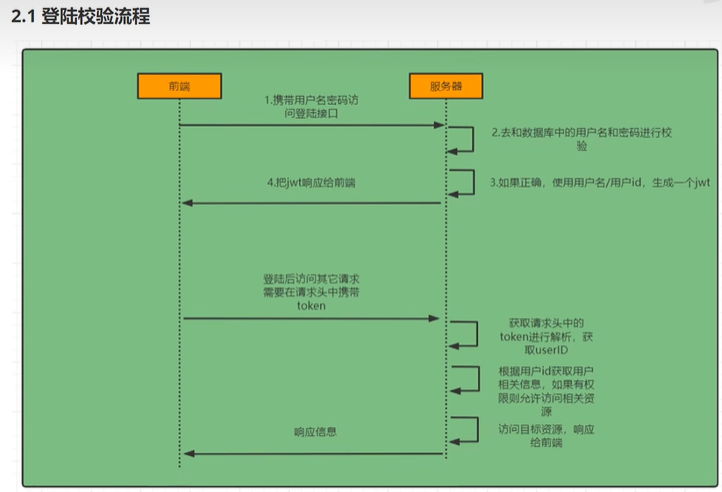


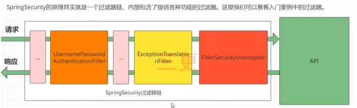


1.UsernamePasswordAuthenticationFilter:用户名和密码的登录请求处理

2.ExceptionTranslationFilter： 处理过滤器链中抛出的任何AccesssDeniedException和AuthenticationException

3.FilterSecurityInterceptor：负责权限的过滤器

Debug查看系统中的过滤器链顺序

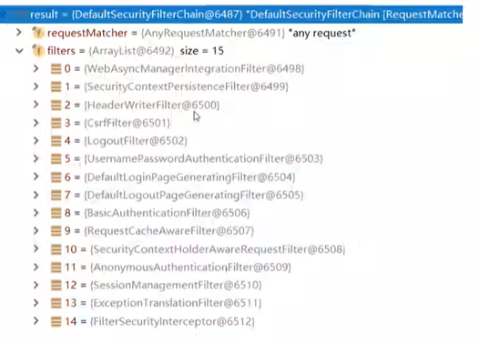

查看方法

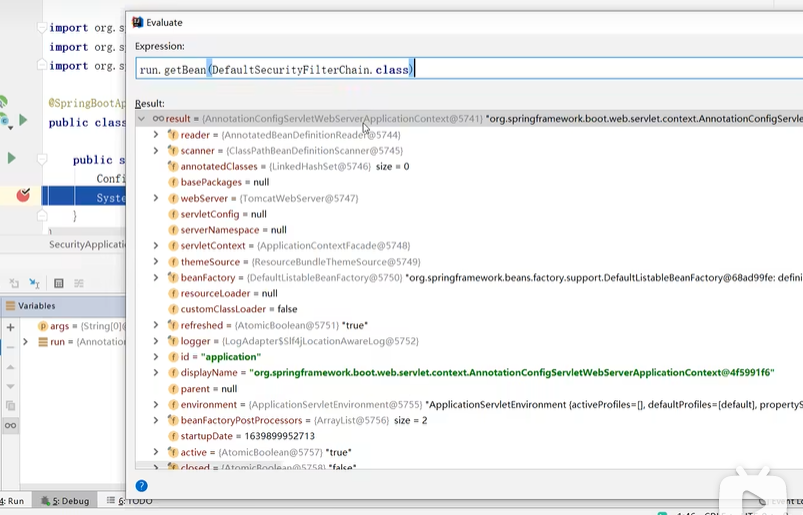


### 3.1认证流程

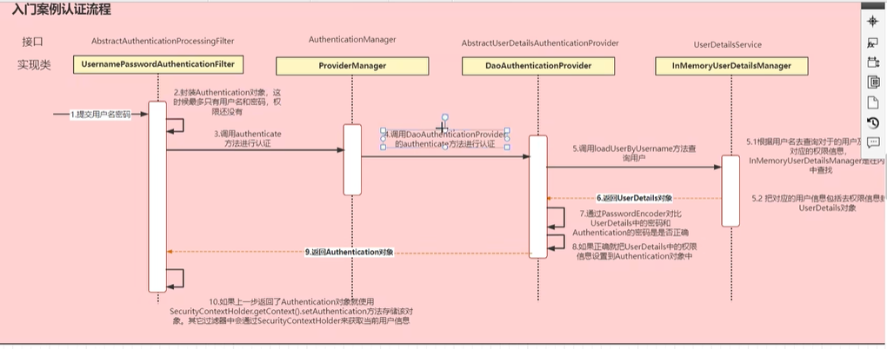


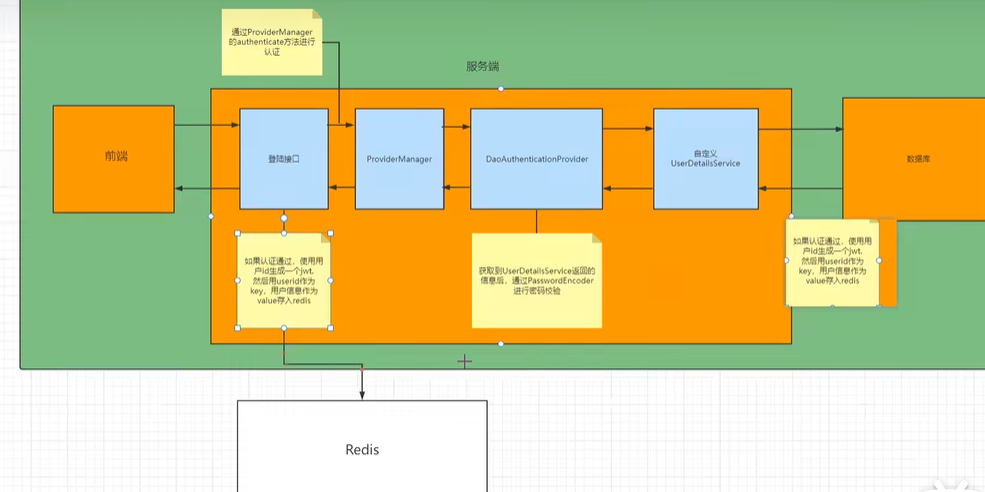

前端要携带token

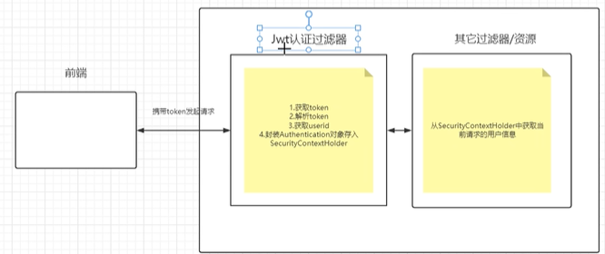

#### 思路分析

登录：

自定义登录接口

​	1.调用ProviderManager方法进行认证，如果认证通过生成jwt

​	2.用户信息存入redis

自定义UserDetailService查数据口

 	1. 在数据库中查询

校验：

定义Jwt认证过滤器

​	1.获取token

​	2.解析token获取其中的userid

​	3.从redis中获取用户信息

​	4.存入securityContextHolder


### 3.2 密码加密存储

​	默认使用PasswordEncoder，要求数据库中密码格式为：｛id｝password,他会根据id判断密码的加密方式。一般要替换之。


​	一般使用SpringSecurity为我们提供的BCryptPasswordEcoder。

​	


陈某的实战情况：

它的认证流程


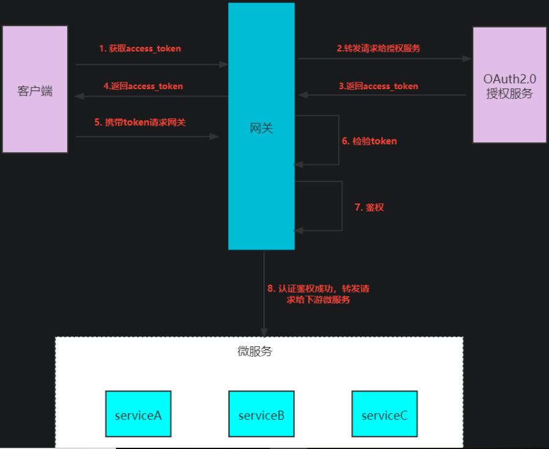

```java
package org.springframework.security.oauth2.provider.endpoint;

这个类中，包含了访问auth/token等操作
   https://blog.csdn.net/weixin_34167043/article/details/92315754
```


### 3.3 认证服务中各个模块测试


#### 1.用户使用password模式授权

在postman中设置好

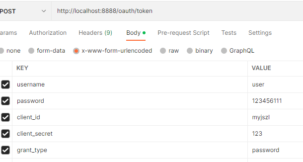

1️⃣当输入错误用户名密码

根据在AuthorizationServerConfig的令牌访问端点中

```java
public void configure(AuthorizationServerEndpointsConfigurer endpoints) {
    
    
    endpoints
        //设置异常WebResponseExceptionTranslator，用于处理用户名，密码错误、授权类型不正确的异常
        .exceptionTranslator(new OAuthServerWebResponseExceptionTranslator())
    
    
}

    /**
     * 根据异常定制返回信息,异常中包含了判断   用户名或密码异常以及不支持的认证方式
     * TODO 自己根据业务封装
     */
    private ResultMsg doTranslateHandler(Exception e) {
        //初始值，系统错误，
        ResultCode resultCode = ResultCode.UNAUTHORIZED;
        //判断异常，不支持的认证方式
        if(e instanceof UnsupportedGrantTypeException){
            resultCode = ResultCode.UNSUPPORTED_GRANT_TYPE;
            //用户名或密码异常
        }else if(e instanceof InvalidGrantException){
            resultCode = ResultCode.USERNAME_OR_PASSWORD_ERROR;
        }
        return new ResultMsg(resultCode.getCode(),resultCode.getMsg(),null);
    }

```

2️⃣当输入错误的grant_type

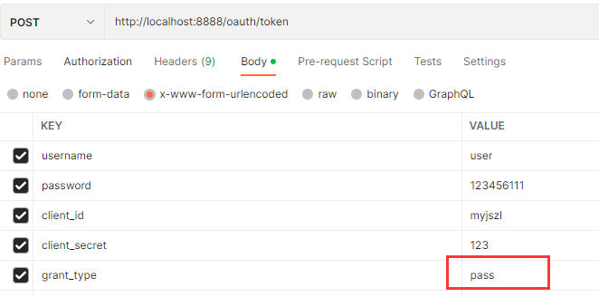

则也会进入上面的异常，从而抛出不支持认证的错误


#### 2.令牌服务-access_token过期时间，refresh_token过期时间，设置令牌增强，使用JwtAccessTokenConverter

```java
在AuthorizationServerConfig    
/**
     * 令牌管理服务的配置
     */
    @Bean
    public AuthorizationServerTokenServices tokenServices() {
        DefaultTokenServices services = new DefaultTokenServices();
        //客户端端配置策略
        services.setClientDetailsService(clientDetailsService);
        //支持令牌的刷新
        services.setSupportRefreshToken(true);
        //令牌服务
        services.setTokenStore(tokenStore);
        //access_token的过期时间
        services.setAccessTokenValiditySeconds(60 * 60 * 24 * 3);
        //refresh_token的过期时间
        services.setRefreshTokenValiditySeconds(60 * 60 * 24 * 3);

        //设置令牌增强，使用JwtAccessTokenConverter进行转换
        services.setTokenEnhancer(jwtAccessTokenConverter);
        return services;
    }
```

```
//设置令牌增强，使用JwtAccessTokenConverter进行转换
services.setTokenEnhancer(jwtAccessTokenConverter);
```


```
/**
 * JwtAccessTokenConverter
 * TokenEnhancer的子类，在JWT编码的令牌值和OAuth身份验证信息之间进行转换。
 * TODO：后期可以使用非对称加密
 */
@Bean
public JwtAccessTokenConverter jwtAccessTokenConverter(){
    JwtAccessTokenConverter converter = new JwtAccessTokenEnhancer();
    // 设置秘钥
    converter.setSigningKey(TokenConstants.SIGN_KEY);
    /*
     * 设置自定义得的令牌转换器，从map中转换身份信息
     * fix(*)：修复刷新令牌无法获取用户详细信息的问题
     */
    converter.setAccessTokenConverter(new JwtEnhanceAccessTokenConverter());
    return converter;
}
```


```
/**
 * @author 公众号：码猿技术专栏
 * 从map中提提取用户信息
 */
public class JwtEnhanceUserAuthenticationConverter extends DefaultUserAuthenticationConverter {

    /**
     * 重写抽取用户数据方法
     */
    @Override
    public Authentication extractAuthentication(Map<String, ?> map) {
        if (map.containsKey(USERNAME)) {
            Collection<? extends GrantedAuthority> authorities = getAuthorities(map);
            String username = (String) map.get(USERNAME);
            String userId = map.get(TokenConstants.USER_ID).toString();
            LoginWfUser user =new LoginWfUser();
            user.setUserId(userId);
            user.setUsername(username);
            user.setPassword("");
            user.setAuthorities(authorities);
            return new UsernamePasswordAuthenticationToken(user, "", authorities);
        }
        return null;
    }

    /**
     * 提取权限
     */
    private Collection<? extends GrantedAuthority> getAuthorities(Map<String, ?> map) {
        Object authorities = map.get(AUTHORITIES);
        if (authorities instanceof String) {
            return AuthorityUtils.commaSeparatedStringToAuthorityList((String) authorities);
        }
        if (authorities instanceof Collection) {
            return AuthorityUtils.commaSeparatedStringToAuthorityList(StringUtils
                    .collectionToCommaDelimitedString((Collection<?>) authorities));
        }
        throw new IllegalArgumentException("Authorities must be either a String or a Collection");
    }

}
```

上述重写方法不知道什么时候回用到。


令牌增强的思路很简单，大致如下：

1. 重写**认证服务**的**JwtAccessTokenConverter#enhance()方法，将额外信息放入到**additionalInformation中。
2. **网关层**通过**全局过滤器**从令牌的**additionalInformation**解析出额外信息，封装到JSON数据中，放入请求头中
3. **微服务层**解析出请求头中的JSON数据，取出额外信息重新封装，方便业务方法直接获取。

#### 3.下游业务方法获取用户信息

1.OncePerRequestFilter 在每次请求时只执行一次过滤。该文件放在common-core包中，同时在需要获取用户的系统服务的MainApplication类中，设置ComponentScan扫描AuthenticationFilter所在的包

```java
public class AuthenticationFilter extends OncePerRequestFilter {
    
}
```

#### 4.有关线程方面的问题

概念巩固：一个进程又多个线程组成，线程池由多个线程队列组成。在并发量高的情况下，需要创建线程池，而不是逐个创建多个线程完成任务。因为频繁地创建和销毁线程会增加系统的资源开销，降低系统的效率。

所以一般由线程池统一管理，还具有阻塞和阻塞队列功能。

1.线程池为了高效利用线程，会复用已创建的线程。根据自身系统，合理对线程池线程数量进行控制。控制并发数，保护系统。

https://blog.csdn.net/m0_73311735/article/details/128418845

实验了，创建100个线程所消耗的时间 264ms，平均一个2.2ms左右，但线程执行任务不到1ms。

在Oauth中，存在openFeign异步请求可能会丢失上文，以及分布式链路追踪时异步调用链路信息的问题。

解决方案，使用一些包装类重新包装一下。RunnableWrapper CallableWarpper SupplierWrapper


#### 5.在全局过滤器中如何鉴权?

```java
try {
    //1. 使用tokenStore来解析token ，查询token 并返回accesstoken结果
    oAuth2AccessToken = tokenStore.readAccessToken(token);
    //2. 获取附加信息 装载入Map
    Map<String, Object> additionalInformation = oAuth2AccessToken.getAdditionalInformation();
    //3. 获取传来token中的jti信息，令牌的唯一ID
    String jti=additionalInformation.get(TokenConstants.JTI).toString();
    /**查看黑名单中是否存在这个jti，如果存在则这个令牌不能用****/
    //4. 从Redis中查询黑名单中的jti信息
    Boolean hasKey = stringRedisTemplate.hasKey(Constants.JTI_KEY_PREFIX + jti);
    //5. 若存在 则直接返回token无效
    if (hasKey)
        return invalidTokenMono(exchange);
    //6. 从token信息中获取用户身份信息，user_name
    String user_name = additionalInformation.get("user_name").toString();
    //7. 从token信息中获取用户权限
    List<String> authorities = (List<String>) additionalInformation.get("authorities");
    //8. 从token信息中获取用户Id
    String userId = additionalInformation.get(TokenConstants.USER_ID).toString();
    //9. 使用JSON装载这些取出来的信息
    JSONObject jsonObject=new JSONObject();
    jsonObject.put(TokenConstants.PRINCIPAL_NAME, user_name);
    jsonObject.put(TokenConstants.AUTHORITIES_NAME,authorities);
    //过期时间，单位秒
    jsonObject.put(TokenConstants.EXPR,oAuth2AccessToken.getExpiresIn());
    jsonObject.put(TokenConstants.JTI,jti);
    //封装到JSON数据中
    jsonObject.put(TokenConstants.USER_ID, userId);
    //10. 将解析后的token加密放入请求头中，方便下游微服务解析获取用户信息
    String base64 = Base64.encode(jsonObject.toJSONString());
    //放入请求头中
    ServerHttpRequest tokenRequest = exchange.getRequest().mutate().header(TokenConstants.TOKEN_NAME, base64).build();
    ServerWebExchange build = exchange.mutate().request(tokenRequest).build();
    return chain.filter(build);
} catch (InvalidTokenException e) {
    //解析token异常，直接返回token无效
    return invalidTokenMono(exchange);
}
```


#### Tips Filter与Interceptor的区别

Filter作用在更靠前的request请求，Interceptor作用在执行controller之前

https://www.java-family.cn/#/OAuth2.0/TransmittableThreadLocal

构造了一个interceptor的preHandle方法

作用：

在preHandle中解析请求头的中的token信息，将其放入SecurityContextHolder（的ThreadLocal）中

在afterCompletion方法中移除对应的ThreadLocal中信息 

确保每个请求的用户信息独立

## 4. NewTech

### 4.1 如何实现.针对单一接口的多个实现类，同时适配所有实现类，然后按优先级调用。

```java
Map<String, PigUserDetailsService> userDetailsServiceMap = SpringUtil.getBeansOfType(PigUserDetailsService.class);
String grantType = paramMap.get(OAuth2ParameterNames.GRANT_TYPE);
String clientId = paramMap.get(OAuth2ParameterNames.CLIENT_ID);
String finalClientId = clientId;
Optional<PigUserDetailsService> optional = userDetailsServiceMap.values().stream()
	// support(finalClientId, grantType) 是否支持此客户端的校验，然后返回布尔值。传来的校验方法和实现类中的校验方法是否相等。相等才能使用，。true or false
    .filter(service -> service.support(finalClientId, grantType))
    // 
    .max(Comparator.comparingInt(Ordered::getOrder));


if (!optional.isPresent()) {
   throw new InternalAuthenticationServiceException("UserDetailsService error , not register");
}

try {
   UserDetails loadedUser = optional.get().loadUserByUsername(username);
   if (loadedUser == null) {
      throw new InternalAuthenticationServiceException(
            "UserDetailsService returned null, which is an interface contract violation");
   }
   return loadedUser;
}catch (UsernameNotFoundException ex) {
    mitigateAgainstTimingAttack(authentication);
    throw ex;
}
```

把一组字符串或者某个类型，装载为流数据：Stream.of(xxxx,xxx,xxx)

它可以实现过滤方法

collect() map() filter() flatMap() max() 和min() sorted() peek等等

```java

.max(Comparator.comparingInt(Ordered::getOrder));
```

### 4.2Redis数据更新，是先更新数据库还是先更新缓存？

https://blog.51cto.com/u_15077560/4528572

最后解决方案就是，更新数据后直接删除缓存。

所以-> MQ一个最大的好处就是提供了一个保障的重试机制。

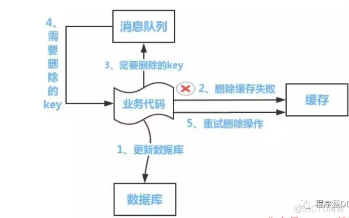


### 4.3  XSS的配置

在公共类中PigXssAutoConfiguration.java

```java
@AutoConfiguration
@RequiredArgsConstructor
@EnableConfigurationProperties(com.pig4cloud.pig.common.xss.config.PigXssProperties.class)
@ConditionalOnProperty(prefix = com.pig4cloud.pig.common.xss.config.PigXssProperties.PREFIX, name = "enabled",
		havingValue = "true", matchIfMissing = true)
@ConditionalOnWebApplication(type = ConditionalOnWebApplication.Type.SERVLET)
public class PigXssAutoConfiguration implements WebMvcConfigurer {

```

1️⃣@AutoConfiguration属于springboot当中autoconfigure包下的注解。springboot给我们提供了好多AutoConfiguration，例如关于缓存cache的有CacheAutoConfiguration，关于定时任务quartz的有QuartzAutoConfiguration，这些AutoConfiguration你会发现基本上都会拿@AutoConfiguration来修饰。

@Target(){ElementType.TYPE}):使用范围   接口 类 枚举 注释

@Retention(RetentionPolicy.RUNTIME):修饰注释生命周期，jvm加载class文件后依然有效

@Documented: 用于生成javadoc

@Configuration  配置类注解

@AutoConfigureBefore 在某类之前加载到容器

@AutoConfigureAfter 在某类之后加载到容器


**使用@AutoConfigure相关注解的前提是必须是自动配置类，可能有时候走了狗屎运给你一种错觉还真的配置成功了。**

@AutoConfiureAfter(xxxxxx.class)

META-INF/spring.factories

org.springframework.boot.autoconfigure.EnableAutoConfiguration=\
com.gzl.cn.springbootcache.config.Config2,\
com.gzl.cn.springbootcache.config.Config1

2️⃣@EnableConfigurationProperties(com.pig4cloud.pig.common.xss.config.PigXssProperties.class)

@EnableConfigurationProperties注解的作用是：使使用 @ConfigurationProperties 注解的类生效。

```java
@Getter
@Setter
@RefreshScope
@ConfigurationProperties(PigXssProperties.PREFIX)
public class PigXssProperties {
    
}
```


3️⃣@ConditionalOnProperty(prefix = com.pig4cloud.pig.common.xss.config.PigXssProperties.PREFIX, name = "enabled",
		havingValue = "true", matchIfMissing = true)

@ConditionalOnProperty注解来控制@Configuration是否生效.

上述表示为PigXssProperties中的前缀，中name=“enabled” 如果值为true才能生效。

4️⃣@ConditionalOnWebApplication(type = ConditionalOnWebApplication.Type.SERVLET)


@ConditionalOnWebApplication和@ConditionalOnNotWebApplication

```java
@ConditionalOnWebApplication(type = ConditionalOnWebApplication.Type.SERVLET)
// 判断当前应用是否是web应用，如果是，当前配置类生效
//底层是Spring的@Conditional注解，根据不同的条件，满足条件的配置类才会生效
```

 这两个注解允许根据应用程序是否是“web应用”来包括配置。举一个例子，我们想为web应用程序暴露服务，为了处理这个用例，我们可以使用@ConditionalOnWebApplication注解。


## 5 problems

### 5.1 出现无法加载 Lookup method resolution failed; nested exception is java.lang.IllegalStateException: Failed to introspect Class[org.springframework.boot.autoconfigure.security.oauth2.resource.reactive.ReactiveOAuth2ResourceServerOpaqueTokenConfiguration$OpaqueTokenIntrospectionClientConfiguration]的问题。

该问题主要是因为OpaqueTokenIntrospectionClientConfiguration中的类无法找到，这也是因为security-core大于了5.7的问题。使用了5.6后问题解决


### 5.2 访问网关出现无效token 右下角报错401

401问题就是授权失败，在后面的实验中也出现了这个问题。第一次是因为 AuthorizationServerConfig类中没有配置客户端服务，查询不到数据库中的客户端签名信息

```java
@Override
public void configure(ClientDetailsServiceConfigurer clients) throws Exception {
    //使用JdbcClientDetailsService，从数据库中加载客户端的信息
    clients.withClientDetails(new JdbcClientDetailsService(dataSource));
}
```


第二次是因为 9201端口下的服务还自带了认证服务，通过在maven exclude security相关组件后，提示缺失了UserDetails。

解决方法是继续exclude，引入security 中的Resource-server相关组件


### 5.3 加入验证码服务 出现getBody 转 字符只能执行一次的错误

这里需要增加一个Filter

\- CacheRequestFilter


```java
/**
 * 获取body请求数据（解决流不能重复读取问题）
 * 
 * @author ruoyi
 */
@Component
public class CacheRequestFilter extends AbstractGatewayFilterFactory<CacheRequestFilter.Config>
{
    public CacheRequestFilter()
    {
        super(Config.class);
    }

    @Override
    public String name()
    {
        return "CacheRequestFilter";
    }

    @Override
    public GatewayFilter apply(Config config)
    {
        CacheRequestGatewayFilter cacheRequestGatewayFilter = new CacheRequestGatewayFilter();
        Integer order = config.getOrder();
        if (order == null)
        {
            return cacheRequestGatewayFilter;
        }
        return new OrderedGatewayFilter(cacheRequestGatewayFilter, order);
    }

    public static class CacheRequestGatewayFilter implements GatewayFilter
    {
        @Override
        public Mono<Void> filter(ServerWebExchange exchange, GatewayFilterChain chain)
        {
            // GET DELETE 不过滤
            HttpMethod method = exchange.getRequest().getMethod();
            if (method == null || method == HttpMethod.GET || method == HttpMethod.DELETE)
            {
                return chain.filter(exchange);
            }
            return ServerWebExchangeUtils.cacheRequestBodyAndRequest(exchange, (serverHttpRequest) -> {
                if (serverHttpRequest == exchange.getRequest())
                {
                    return chain.filter(exchange);
                }
                return chain.filter(exchange.mutate().request(serverHttpRequest).build());
            });
        }
    }

    @Override
    public List<String> shortcutFieldOrder()
    {
        return Collections.singletonList("order");
    }

    static class Config
    {
        private Integer order;

        public Integer getOrder()
        {
            return order;
        }

        public void setOrder(Integer order)
        {
            this.order = order;
        }
    }
}
```

