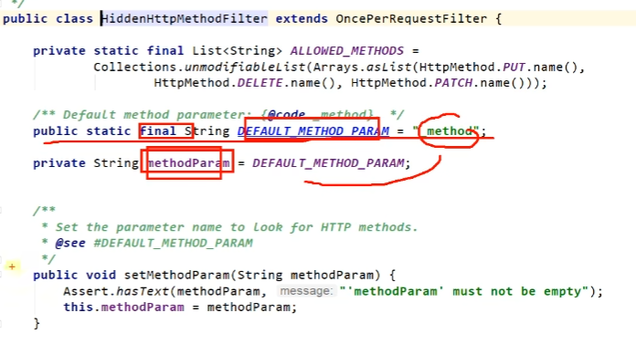
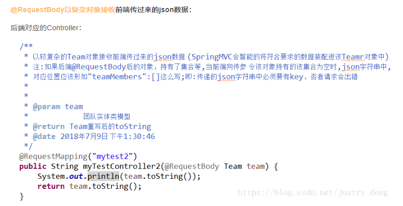
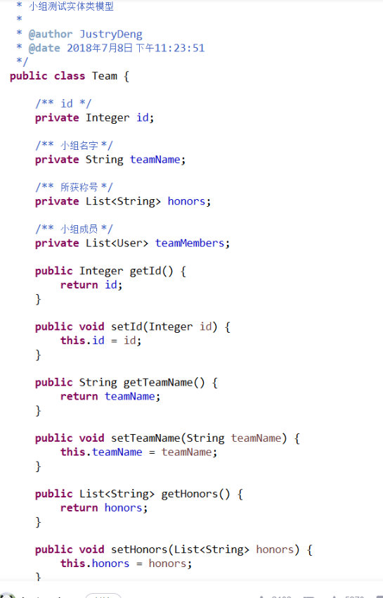
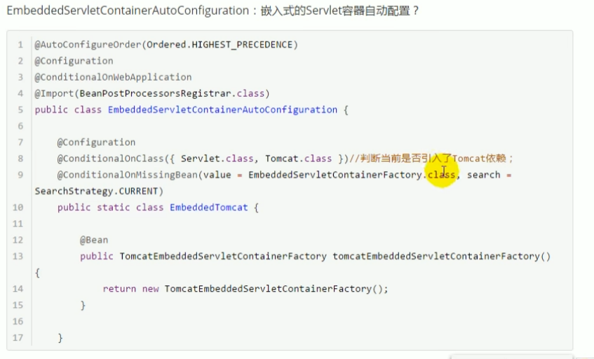
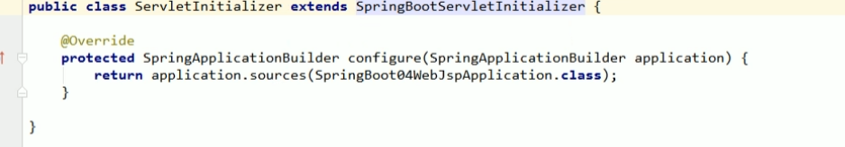
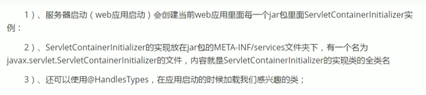
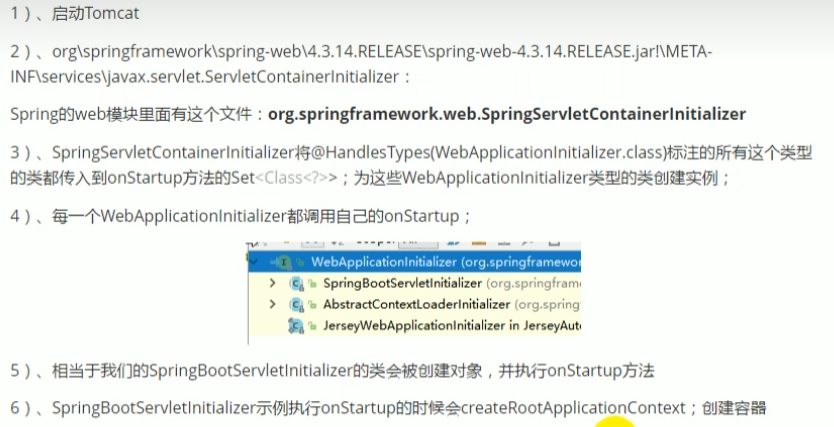
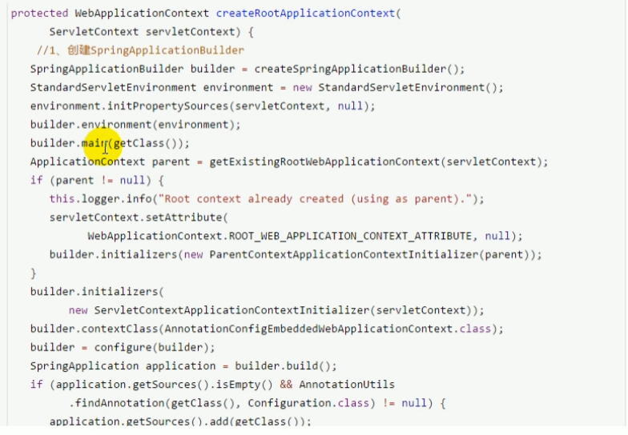
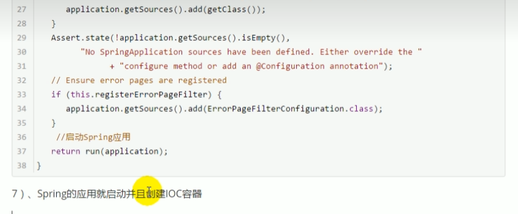

# 2、容器功能

## 2.1组件注释种类

@Configuration

一般用来告诉Spring 该类是一个配置类 == 配置文件  .xml

```java
 @Configuration
public class MyConfig{
	@Bean //给容器添加组件，以方法名作为组件的id。返回类型就是组件类型。返回值就是组件在容器中的实例
	public User user01(){
		return new User("zhangsan",18);
	}
    
}

run.getBeanName("",xxx.class)
```

懒汉式与饿汉式的区别。是在与建立单例对象的时间的不同

懒汉：先判断是否为空，空则创建，否则直接return。若不加上synchronized则会导致对象的访问不是线程安全的。


```java
public class Singleton{
    private Singleton(){}
    private static Singleton singleton = null； //不建立对象
    public static synchronized Singleton getInstance(){
        if(singleton == null) { //先判断是否为空
            singleton = new Singleton (); //懒汉式做法
        }
        return singleton;
    }
}

```

饿汉：在开始就建立该单例对象。线程安全，以后不再改变

代理bean方法默认是单例

@Configuration(proxyBeanMethods==true)   full模式  单例 

@Configuration(proxyBeanMethods==false)  lite模式 多例 

full模式，每次外界调用某bean就会检查该bean是否存在。

lite模式，每次外界调用某bean不管bean是否存在，直接返回新的实例对象。


@Import 


基本使用

@Bean、@Component、@Controller、@Service、@Repository


@ComponentScan

```java
@SpringBootConfiguration
@EnableAutoConfiguration 
@ComponentScan("com.xxx.xxx")
public class MainApplication(String[] args){
   
}
```

@Import

给容器自动创建对应类型的组件

```java
@Import({xxx.class,DBHelper.class}) // 容器中存在com.xxx.xxx.bean.User   ch.qos.logback.core.db.DBHelper@sssxasdf  全类名
@Congfiguration(proxyBeanMethods=false)
public class MyConfig{
    
}
```

@Conditional

条件装配，满足Conditional指定的条件，则进行组件的注入

```java
 @Configuration
public class MyConfig{
	@ConditionalOnBean(name="tom")
    @Bean //给容器添加组件，以方法名作为组件的id。返回类型就是组件类型。返回值就是组件在容器中的实例
	public User user01(){
		return new User("zhangsan",18);
	}
    //@Bean("tom")
    //因为老师这里执行调用的顺序是先user01然后才到tom的，你执行user01时tom方法还没调用【组件还没有被注册】，所以结果是false
 	public Pet tomcatPet(){
        return new Pet("tomcat");
    }   
}
```

@ImportResource("classpath:beans.xml")   导入配置资源

@ConfigurationProperties

## 2.2 配置绑定

前缀统一时，使用该方法， 不同一时使用value

1. @Component+@ConfigurationProperties

```java
xxx.yaml or properties
xxx.sss = BYD
xxx.rrr = 111111
@Componenet 只有在容器中的组件Springboot才能提供
@ConfigurationProperties(prefix="xxx") // 前缀为xxx的配置
public class XXX {
    
}    

```

2. @EnableConfigurationProperties+@ConfigurationProperties //这种方式主要是因为，如果要引入第三方包，不改源码的情况下，还要加入该功能。

```java
@EnableConfigurationProperties(Car.class) //针对指定的car， 这样就不需要在xxx类上写@Component
public class MyConfig(){
    
}

```

# 3.自动装配原理

## 3.1

```java
@SpringBootApplication // 导入xxx.xxx.xxx目录下的所有组件

包含的第一个注解
	@SpringBootConfiguration 
   	他是一个@Configuration，代表当前是一个配置类。
第二个
	@ComponentScan 扫描哪些

第三个
    @EnableAutoConfiguration
	{
    	@AutoConfigurationPackage
        @Import(AutoConfigurationImportSelector.Registrar.class)    
    	这个Registrar包含的 registerBeanDefinitions能批量给容器注册组件，其中，参数 AnnotationMetadata metaadata ,就包含了
	}

@Import(AutoConfigurationEntry.class)
1.getAutoConfigurationEntry中的 2. getCandidateConfigurations();//获取到被标记@Configuration的所有组件
3.在进一步使用Spring        Map<String,List<String>> loadSpringFacotories(@Nullable Classloader classLoader) // 得到所有的组件
4. 再从META-INF/spring.factories位置来加载一个文件
    默认扫描当前系统里面所有META-INF/spring.facotries位置的文件
    spring-boot-autoconfigure-2.3.4.....
	该.facotries文件中 列出了所有需要加载的class 127个
int beanDefinitionCount = run.getBeanDefinitionCount(); // 输出134
```

## 3.2按需开启自动配置项

如何实现按需加载呢？Conditional

```java
有了这个Advice对应的包，这个类才能生效
@ConditionalOnClass(Advice.class)
static class AspectJAutoProxyingConfiguration{}

同理还有批处理，访问数据库等等功能组件，虽然存在其中，但需要有条件才能。
如
@Configuration(proxyBeanMethods=false)  //lite模式 调用就加载
@ConditonalOnProperty(prefix="spring.aop",name="auto",havingValue="true",matchIfMissing=true)// 需要条件是 在配置文件中，存在前缀spring.aop name=auto 默认true
public class AopAutoConfiguration{
    
}


@AutoConfigureAfter(ServletWebServerFacotryConfiguration.class) // b表示需要先让ServletWebServerFacotryConfiguration.class启动了，再启动被标记类


@EnableConfigurationProperties(WebMvcProperties.class)
1. 执行WebMvcProperties{@ConfigurationProperties(prefix='spring.mvc')}文件的配置绑定功能
2. 使使用 @ConfigurationProperties 注解的类生效。
    如上次学习到的。同样，可以使用 @Component+@ConfigurationProperties
    
文件上传解析器
@Bean
@CondtionalOnMissingBean(name=DispatcherServlet.MULTOPART_RESOLVER_BEAN_NAME) //容器没有这个名字时 ，生效
public MultipartResolver multipartResolver(MultipartResolver resolver){
	// 给@bean标注的方法传入了对象参数，这个参数的值就会从容器中找。
    // 最后return resolver，其bean id就是multipartResolver,较好的统一了名字，防止有用户配置的文件上传解析器不符合规范。
    return resolver
}

@Bean
@ConditionalOnMissingBean //表示当然容器中没有，SpringBoot帮忙配置，
public CharacterEncodingFilter characterEncodingFilter(){ //拦截请求来设置数据的编码
    
}
//优先用户，用户配置了，就用用户的
@Bean
public CharacterEncodingFilter filter(){ //拦截请求来设置数据的编码
    return null;
}
SpringBoot会优先加载所有自动配置类。
每个自动，配置类按照条件生效，默认都会绑定配置文件*(xxxx.properties)指定值
生效配置类会给容器中装配很多组件
容器有组件，表示组件启动
用户配置优先
    xxxxAutoConfiguration ---> 导入组件 --> 从xxxproperties获取值 --> properties又会从 application.yaml获取值
```


```java
@
```

# 3.请求处理

## 3.1 @RestController

 Rest风格支持

以前：/getUser  /delete   /editUser   /saveUser

现在：/user   GET   DELETE   PUT   POST


@RequestMapping(value="/user",method=RequestMethod.GET)

表单中需要添加隐藏

并且配置中手动开启

```java
必须为post
spring:
mvc:
hiddenmethod:
filter:
enable: true

<from action="/user" method="post">
	<input name="_method" type="hidden" value="DELETE"/>
	<input type="submit" value="REST-PUT"/>
</from>

```

Rest原理（当表单提交时）：

1.表单提交会带上method=PUT

2.请求被HiddenHttpMethodFilter拦截    doFilterInternal拦截

3.获取_method,必须为POST

原生request(POST)，包装模式 requestWrapper重写了getMethod,返回的是传入的值

**过滤器链放行的时候用wrapper。以后的方法调用getMethod()是调用的requestWrapper中的**

最后省略为

@GetMapping("/user")

@PostMapping("/user")

@PutMapping("/user")

@DeleteMapping("/user")





使用final关键字修饰一个变量时，是指引用变量不能变，但是引用变量所指向的对象中的内容还是可以改变的。 作者：网星软件 https://www.bilibili.com/read/cv17715599 出处：bilibili


常用注解

```java
// GET浏览器发送 car/2
@GetMapping("/car/{id}/owner/{username}?age=18&inters=fdfdfd&inters=ga")
public Map<String,Object> getCar(@PathVariable("id") Integer id,
                                @PathVariable("username") String name,
                                或者 @PathVariable Map<String,String> pv,
                                @RequestHeader("User-Agent") String userAgent,
                                 @RequestHeader Map<String,String> header
                                 @RequestParam("age") Integer age,
                                @RequestParam("inters") List<String> inters
                                @RequestParam Map<String,String> params,
                                @CookieValue("_ga") String _ga)
    						
@RequestBody 获取请求体，只有post才有  ，表单里的数据
前端需要设置 header application/json

@PostMapping("/save")
public Map postMethod(@RequestBody String content){
    Map<String,Object> map = new HashMap<>();
    map.put("content",content);
    return map;
}
@RequestBody主要用来接收前端传递给后端的json字符串中的数据的(请求体中的数据的)；而最常用的使用请求体传参的无疑是POST请求了，所以使用@RequestBody接收数据时，一般都用POST方式进行提交。在后端的同一个接收方法里，@RequestBody与@RequestParam()可以同时使用，@RequestBody最多只能有一个，而@RequestParam()可以有多个。

追注：这里与feign消费服务时不同；feign消费服务时，如果参数前什么也不写，那么会被默认是
                  @RequestBody的。
如果后端参数是一个对象，且该参数前是以@RequestBody修饰的，那么前端传递json参数时，必须满足以下要求：

后端@RequestBody注解对应的类在将HTTP的输入流(含请求体)装配到目标类(即：@RequestBody后面的类)时，会根据json字符串中的key来匹配对应实体类的属性，如果匹配一致且json中的该key对应的值符合(或可转换为)，这一条我会在下面详细分析，其他的都可简单略过，但是本文末的核心逻辑代码以及几个结论一定要看！ 实体类的对应属性的类型要求时,会调用实体类的setter方法将值赋给该属性。

json字符串中，如果value为""的话，后端对应属性如果是String类型的，那么接受到的就是""，如果是后端属性的类型是Integer、Double等类型，那么接收到的就是null。

json字符串中，如果value为null的话，后端对应收到的就是null。

如果某个参数没有value的话，在传json字符串给后端时，要么干脆就不把该字段写到json字符串中；要么写value时， 必须有值，null  或""都行。千万不能有类似"stature":，这样的写法，如:

```





各种方法组合使用

https://blog.csdn.net/justry_deng/article/details/80972817/


# 配置嵌入式Servlet容器

1. 如何定制和修改servlet容器

   ```java
   server.port = 8080
   server.context-path=/crud
       
   //通用
   server.xxx
   server.tomcat.xxx
       
       
   ```

   2. 编写一个

   3. ```java
      public WebServerFactoryCustomizer<ConfigurableWebServerFactory> webServerFactoryCustomizer(){
      
      	@Override
      	public void customize(ConfigurableEmbeddedServletContainer container){
              container.setPort(8083);
          }
      
      }
      ```

      注册Servlet、Filter、Listener

      ```java
      @Configuration
      public class MyServerConfig{
          //注册三大组件 
          public ServletRegisterationBean myServlet(){
              ServletRegistrationBean registrationBean = new ServletRegistrationBean(new MyServlet(),"/myServlet");
              return registrationBean;
                  
          }
          public FilterRegistrationBean myFilter(){
              FilterRegistrationBean registrationBean = new FilterRegistrationBean();
              registrationBean.setFilter(new MyFilter());
              registrationBean.setUrlPatterns(Arrays.asList("/hello","myServlet"));
              return registrationBean;
      	}
          public ServletListenerRegistrationBean myListener(){
              ServletListenerRegistrationBean  = new ServletListenerRegistrationBean<MyListener>(new MyListener);
              return registrationBean;
          }
      
      }
      public 
      public class MyServlet extends HttpServlet{
          //get
          
          //post
          
      }
      
      
      public class MyFilter implements Filter{
      	@Override
          sout("myFilter process....");
          chain.doFilter(request,response);
      }
      
      ```

      

   默认的servlet容器是tomcat

   springboot还支持jetty（长连接，聊天等） undertow(高性能非阻塞)

   如何引入呢？

```xml
	<dependency>
    	spring-boot-starter-jetty
        org.springframework.boot
    </dependency>
```

 



嵌入式Servlet启动原理

优点:简单便携

缺点:默认不支持jsp，优化定制比较复杂

## 外部安装tomcat并启动以及应用war包方式打包

1.必须创建一个war项目

2.将嵌入式tomcat指定为provided

```xml
<dependency>
    org.springframework.boot
    spring-boot-starter-tomcat
    <scope>provided</scope>
</dependency>
    
```

3.必须便携一个SpringBootservletInitializer的子类，并调用Configure方法



4.启动服务器就可以使用


原理：

jar： 1.Springboot主类main方法，启动ioc容器，创建嵌入式的servlet容器

war：启动tomcat，服务器启动SpringBoot应用【SpringBootServletInitializer】，启动ioc容器。

servlet3.0 spring 注解版

规则：

​	

流程







总之，就是先启动Servlet容器，在启动Springboot应用

jar包和war包的区别：
1、war是一个web模块，其中需要包括WEB-INF，是可以直接运行的WEB模块；jar一般只是包括一些class文件，在声明了Main_class之后是可以用java命令运行的。

2、war包是做好一个web应用后，通常是网站，打成包部署到容器中；jar包通常是开发时要引用通用类，打成包便于存放管理。

3、war是Sun提出的一种Web应用程序格式，也是许多文件的一个压缩包。这个包中的文件按一定目录结构来组织；classes目录下则包含编译好的Servlet类和Jsp或Servlet所依赖的其它类（如JavaBean）可以打包成jar放到WEB-INF下的lib目录下。

JAR文件格式以流行的ZIP文件格式为基础。与ZIP文件不同的是，JAR 文件不仅用于压缩和发布，而且还用于部署和封装库、组件和插件程序，并可被像编译器和 JVM 这样的工具直接使用。


https://blog.csdn.net/weixin_40910372/article/details/89515686

### jar包

直接通过内置tomcat运行，不需要额外安装tomcat。如需修改内置tomcat的配置，只需要在spring boot的配置文件中配置。内置tomcat没有自己的日志输出，全靠jar包应用输出日志。但是比较方便，快速，比较简单。

### war包

传统的应用交付方式，需要安装tomcat，然后放到waeapps目录下运行war包，可以灵活选择tomcat版本，可以直接修改tomcat的配置，有自己的tomcat日志输出，可以灵活配置安全策略。相对打成jar包来说没那么快速方便。


