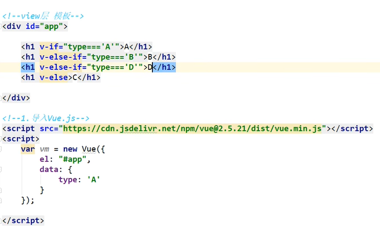

v可看作指令

v-bind:

v-if

v-else




事件 --- on

```a
// 安装vue-cli脚手架
npm install vue-cli -g

//
npm install webpack -g
//设置系统权限 windows
set-ExecutionPolicy RemoteSigned
//初始化项目
vue init webpack myvue
//启动
npm run dev

//安装ElementUI
npm i element -ui -s
elementUi官网有更详细的说明

npm install modulename
npm install -g modulename 安装到磁盘全局目录下
npm install -save moduleName -save的意思是将模块安装到项目目录下.并在package文件的Dependenies结点写入依赖

npm install -save-dev moduleName   

安装ssas或者什么东西时不要--force 要使用--legency-peer-dept不覆盖安装，不然可能会出问题
npm install sass-loader node-sass --save-dev --legency-peer-dept
```


# Vue中遇到的问题

## 1. v-for遍历数组后，如果不使用push新增，使用array[n]=会导致数据无法刷新

解决方法：this.$set(this.dynamicTags,1,cn_str); 替代this.dynamicTags[1] = cn_str;

